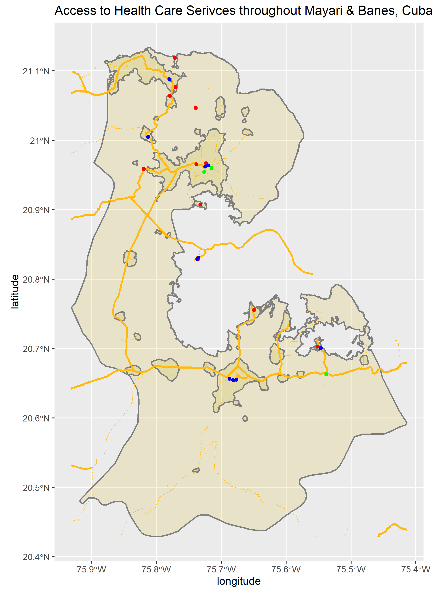

# Final Project Individual Deliverable: Cuba

## Political Subdivisions

The nation of Cuba is divided into 15 provinces (adm1) and 168 municipalities (adm2) within those provinces. The capital, La Havana, lies in the northwest in a densely populated region. Throughout these projects, I have focused primarily on the Holguin and Santiago de Cuba provinces, both of which lie in the southeast. The Holguin prvoince directly borders the Atlantic Ocean to the north, while the Santiago de Cuba province directly borders the Caribbean Sea to the south. I also went deeper into the Holguin province in order to analyze the Mayari and Banes municipalities. The data behind these boundaries was dated for 2020 and sourced from GADM. 

## Population Analysis

The plot above is a population density map and bar graph for Cuba in 2020. Both the map and bar graph are specific to the first administrative level in Cuba: the provinces. Both representations of population data also show the percent of the total population living within each individual province both by percent/numerical values, as well as by color, with a legend on the right defining the colors. As of 2018, the total population of Cuba is estimated to be 11.34 million (World Bank, U.S. Census Bureau). By both the map and graph, it is apparent that there is a spike in population in the northwest in the province of Ciudad de la Habana, which is where slightly over 2 million people as well as the nation's capital reside. The bar graph also shows that the provinces of Santiago de Cuba and Holguin are the second and third most populated provinces respectively. 

***

The log plot above more specifically represents the populations of the 168 municipalities (adm2) of Cuba. The most apparent spike in population appears to be in the southeast, in the municipality of Santiago de Cuba (not to be confused with the similarly named province), which has a population of just about 470,000. It's interesting to note that even though a very apparent relatively high population count was observed in the Ciudad de la Habana province in the earlier combined plot, on a municipality level, the tame shade of orange represents that no one municipality within the province has a starkly high population compared to the rest of the nation. 

***

To delve deeper into population analysis, I attempted to predict the population spread in the province of Santiago de Cuba using several covariates, such as water, topography, slope, night-time lights, herbaceous cover, and urban and bare areas. With these predictors, I was able to judge where people may live by using the principle that where exists more night-time lights, there generally exists more people, and so on for all of the covariates. These population count predictions were then compared to real-world counts provided by WorldPop. The map above overlapped with OpenStreetMap shows the comparison, by showing whether the population counts predicted by using all covariates are over-predictions or under-predictions when compared to the actual spatial distribution of population. The regions shaded in purple generally represent regions of high population density—such as the province's capital city of Santiago de Cuba in the south—which have under-predicted population values provided by the covariates. The three-dimensional map above depicts the population spread by individual municipalities, showing that the highest concentration of population within the province lies in the capital city. The regions of high population density are marked in purple—signifying an underestimate by use of the covariates—likely due to multi-story buildings—which are common to urban areas—are not accurately accounted for by the covariates. On the flip side, it is also seen that regions of relatively low population take on a orange-yellow shade, as the covariates slightly over-predict the population counts in these areas. 

## Analyzing Human Settlements, Roadways, and Healthcare Facilities

To analyze how roadways and healthcare facilities are correlated with urban areas, I chose to look at the municipalities of Mayari (population ~ 105,000) and Banes (~78,000) in the Holguin province. The plot above shows the de facto boundaries of urbanized areas throughout these municipalities, as well the road network and health care services. The thick lines that run between the municipalities represent primary and secnodary roads  

through the town of Mayari and through the much of the rest of the municipality is the primary road. The slightly thinner lines that branch off from the primary road represent the secondary roads, while the slightly transparent lines represent tertiary raods. It is apparent that the roads branch off to just about each urbanized area polygon. The colored dots represent the position and type of health care service, with the 5 red dots representing hospitals, the 2 green dots represting clinics, and the blue dots representing either the 5 pharmacies or 1 dentist. The 2 blue dots and 1 red dot in the north-northwest are representative of the health care services available in the relatively small neighboring municipality of Antilla, which is also in the Holguin province. 

Judging by this plot, it's apparent to see how road networks were created to connect the urbanized areas, as just about each of the distinguished areas are accessible by a roadway. 

