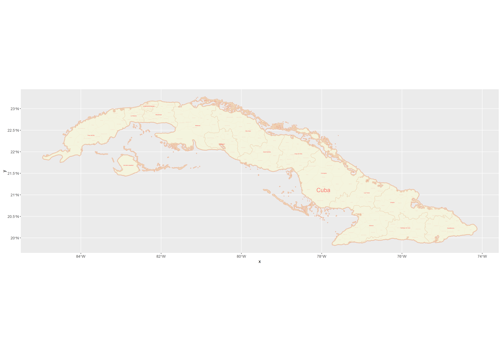

# Final Project Deliverable: Cuba

## Political Subdivisions

The nation of Cuba is divided into 15 provinces (adm1) and 168 municipalities (adm2) within those provinces. The capital, La Havana, lies in the northwest in a densely populated region. Throughout these projects, I have focused primarily on the Holguin and Santiago de Cuba provinces, both of which lie in the southeast. The Holguin prvoince directly borders the Atlantic Ocean to the north, while the Santiago de Cuba province directly borders the Caribbean Sea to the south. I also went deeper into the Holguin province in order to analyze the Mayari and Banes municipalities. The data behind these boundaries was dated for 2020 and sourced from GADM. 

## Population Analysis

The plot above is a population density map and bar graph for Cuba in 2020. Both the map and bar graph are specific to the first administrative level in Cuba: the provinces. Both representations of population data also show the percent of the total population living within each individual province both by percent/numerical values, as well as by color, with a legend on the right defining the colors. 

The graphs accurately present the data, as it is true as of 2020 that the province “Ciudad de la Habana” has the greatest population between the provinces, and likewise all of the other data points seem to run true to form. The population seems to be fairly even throughout the nation, save for a slight above-average population count in the south-eastern portion, as well as the apparent spike in population in the the one province in the north-west. The numbers within the provinces on the map represent the population in persons/km^2.
