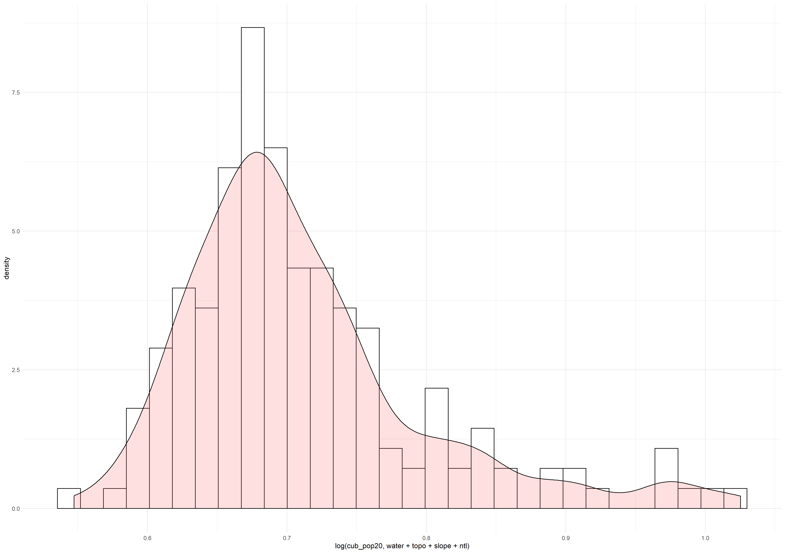
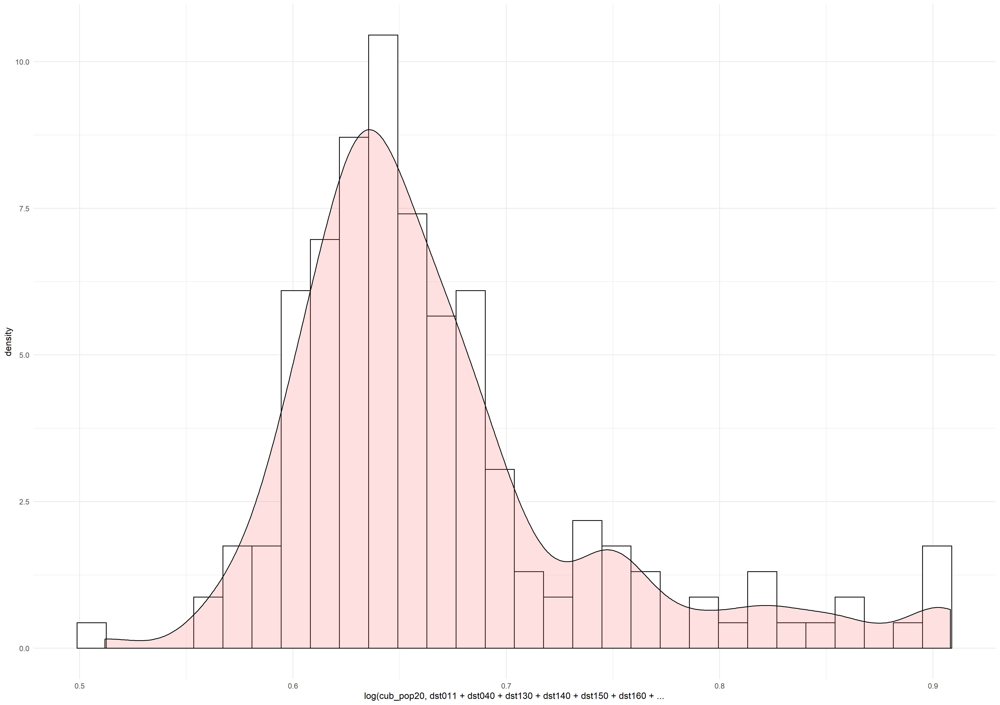
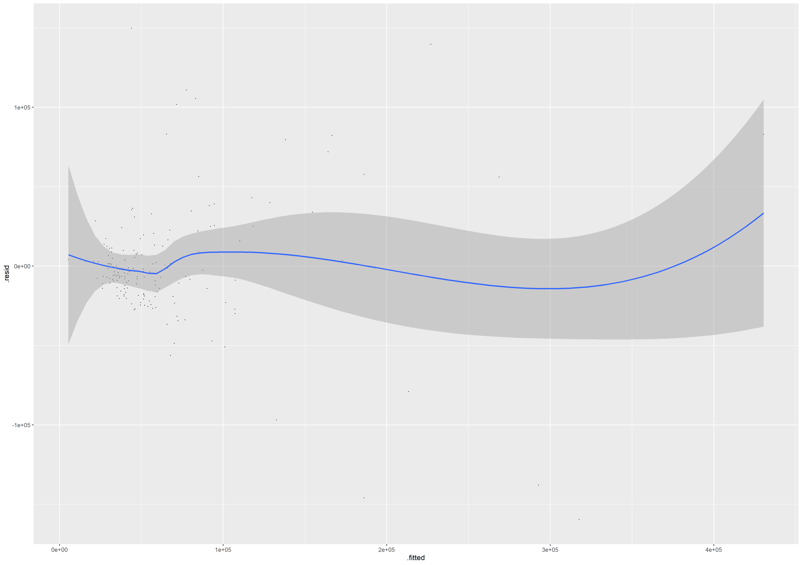
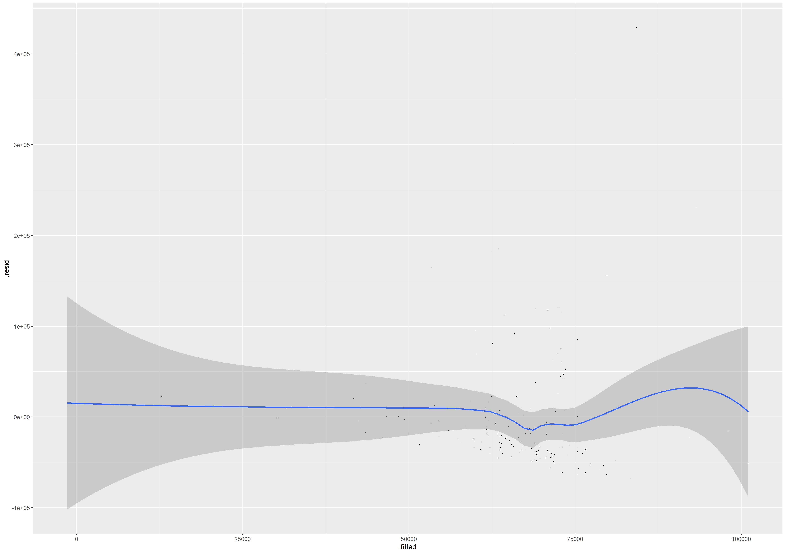
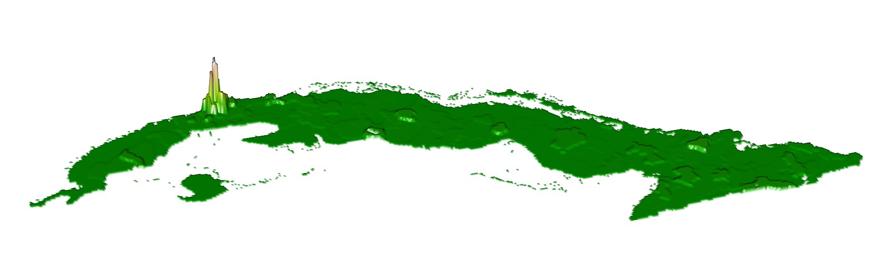
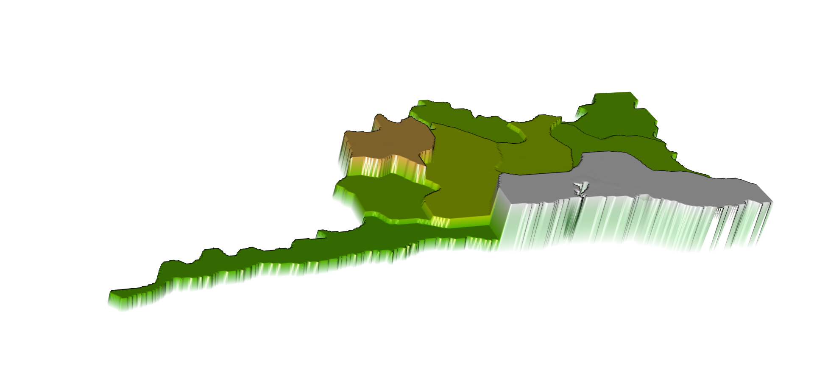

# Project 2: Cuba CLEAR OUT EXTRA LINES WHEN DONE

## Part 1: Acquiring, Modifying, and Describing the Data

text text sample text here

text text sample text here

## Part 2: Modeling and Predicting Spatial Data

text text sample text here

