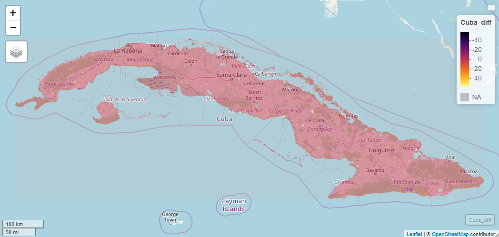

# Project 2: Cuba 

## Part 1: Acquiring, Modifying, and Describing the Data

These graphs represent predictions of Cuba's population density based on differing covariates. Several covariates—which make predictions of population counts in specified regions based on specific landmarks or traits seen in acquired satellite images—were used in this project. The top graph represents an overlap of a histogram and density plot showing how the covariates of water, topography, slope, and night-time lights, while the bottom graph uses several dst covariates, which include herbaceous cover, and urban and bare areas. The 168 municipalities of Cuba are represented in these graphs. Population counts are modified with a log function so as to reduce the effect of any one outlier that may have a significantly higher or lower population count than the rest of the municipalities.  

***

These plots represent a regression model showing the relationship that is described by the actual spatial distribution of population estimated by WorldPop in Cuba compared to differing covariates. The top graph depicts how the covariates of water, topography, slope, and night-time lights predict population counts in Cuba's 168 municipalities (individual points on the plot), while the bottom graph uses several dst covariates. Both graphs display many municipalities that do not lie within the confidence interval nor close to the regression line, showing that the specific combinations of covariates are not the best for predicting the population in Cuba. The top graph resulted in an adjusted R-squared value of 0.6662, and a p-value of 2.2e-16, showing that the prediction wasn't all too bad. However, the bottom graph yielded an adjusted R-squared value of -0.01751 and a p-value of 0.7426. This was quite surprising, as there were 8 dst covariates used to produce the plot, and yet a negative adjusted R-squared value was produced, and a significantly large p-value as well, showing that the prediction of population count was not entirely accurate.  

***

## Part 2: Modeling and Predicting Spatial Data

These graphs depict the population of Cuba in slightly different ways. The three-dimensional map represents the population values of Cuba, with the peaks representing regions of higher population counts. Note that this map does not represent the log of the population, leading to much of the land to appear relatively flat. The capital of Cuba, Havana (Ciudad de la Habana), lies in the northwest along with many other highly populated municipalities, resulting in the high peaks. The map overlapping with OpenStreetMap represents the difference in predicted population counts using all covariates (mentioned above) and actual spatial distribution of population estimated by WorldPop. The majority of the map takes on a somewhat pink-ish color, exhibiting that the population count predicted by the covariates is not far off from the actual values. However, purple dots are apparent on more highly populated regions, such as the capital cities of the provinces, meaning that the covariates under-predict the actual population count in regions of high population density. This may be explained by the covariates not effectively accounting for the multi-story buildings that are typical in densely-populated cities. 

***

Similarly to the graphs before, these two graphs represent the population of the province of Santiago de Cuba. Santiago de Cuba is the second most populated province in Cuba, just after the capital province, Havana (La Habana). The three-dimensional map depicts the population spread by individual municipalities. The apparent peak in population in the southeast is due to the capital city of the province—also known as Santiago de Cuba—which is the most populous municipality in Cuba. Again, population counts are not represented by their log values. The map overlapped with OpenStreetMap shows whether the population counts predicted by using all covariates (mentioned above) are over-predictions or under-predictions when compared to the actual spatial distribution of population estimated by WorldPop. The regions shaded in purple represent regions of high population density—such as the province's capital city—which have under-predicted population values provided by the covariates. Just as with the Cuba maps above, one reasonable explanation may be that multi-story buildings are not accurately accounted for by the covariates. Also seen in this map is that regions of relatively low population take on a orange-yellow shade, as the covariates slightly over-predict the population counts in these areas. 

