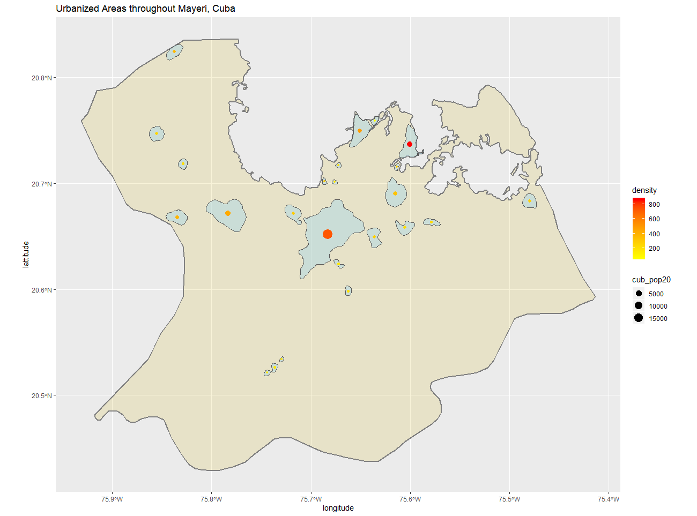

# Project 3: Cuba 

## Part 1: De Facto Description of Human Settlements and Urban Areas

Shown above is a produced plot which depicts the de facto boundaries of urbanized areas throughout the municipality of Mayari in the Holguin province of southeastern Cuba. Mayari is the second largest municipality in Holguin with a population of about 105,000 over 1,300 km^2. Polygons that are shaded in light blue represent an urbanized area, and the size and color of the point represent the population and density of any such urbanized area. The largest polygon, in the center of the plot, is the town of Mayari with a population of about 30,000. The bright red dot in the north-northeast is representative of the town of Felton, which only has a population of 1,776 but a high density due to the relatively small area. In order to limit the number of individual urbanized areas, a density filter was used to remove areas with a density less than 70 and higher than 660. 

***

## Part 2: Adding Transportation Facilities & Health Care Services

Shown above is a produced plot which depicts the de factor boundaries of urbanized areas throughout Mayari, as well the road network and health care services. The thick line that runs through the town of Mayari and through the much of the rest of the municipality is the primary road. The slightly thinner lines that branch off from the primary road represent the secondary roads, while the slightly transparent lines represent tertiary raods. It is apparent that the roads branch off to just about each urbanized area polygon. The colored dots represent the position and type of health care service, with the 5 red dots representing hospitals, the 2 green dots represting clinics, and the blue dots representing either the 5 pharmacies or 1 dentist. The 2 blue dots and 1 red dot in the north-northwest are representative of the health care services available in the relatively small neighboring municipality of Antilla, which is also in the Holguin province. 

