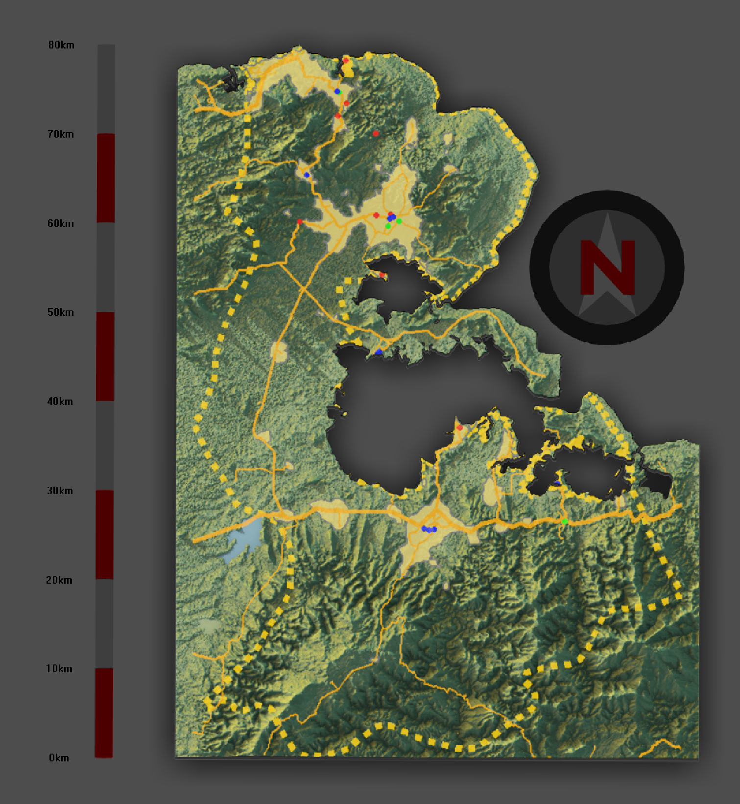
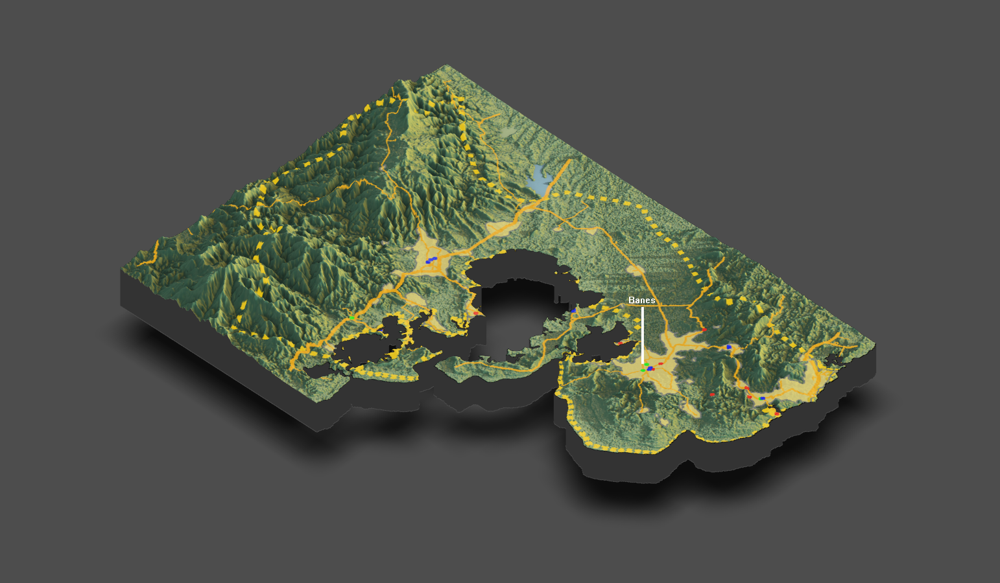

# Project 4: Cuba

## Part 1: Rendering Topography

Here we have the two municipalities of Mayari and Banes of the Holguin province in southeastern Cuba. On the top left is a bird’s eye or top down view of the combined municipalities as if you were looking at a traditional map. Of course, the compass points towards north, and the scalebar along the left shows that the region is just about 80 kilometers long. On the bottom is the more traditional three-dimensional plot that expresses topographical information. 

If looking at the bird’s eye view, the top half of the land is the municipality of Banes, while the bottom half is Mayari. The municipality of Mayari has a total population of just about 100,000 people, while Banes has a population of about 80,000, leading to a total combined population of around 180,000 individuals. 

You can see the border of the combined municipalities by the yellow dashed line, while the solid gold line represents primary roadways, and the shaded areas of land represent urban areas. The various colored dots represent health care facilities, with the red dots representing hospitals (16), the green dots representing clinics (5), and the blue dots for doctors (5), dentists (2), and pharmacies (8). 

The labeled location is the town of Banes, which is located inside the similarly named Banes municipality. It is the single largest town or settlement between the combined municipalities with a 2012 census population of just about 35,000 individuals. 

Looking at these plots, I think it’s pretty apparent that topography has impacted the development of urban areas, as you can see in the Mayari municipality a relatively large urban area and a couple other smaller urban areas right at the foot of the mountains, while no urban areas exist among the mountainous area in the south. Likewise, in the Banes municipality, you can see the prime urban area exists on relatively flat land as well. In this way, you can also see how the development of healthcare facilities was affected by topography, as the healthcare facilities seem to be located within urban areas, and the development of urban areas was influenced by topography. 
Similarly for the development of road networks, the primary roads in the Mayari municipality for the most part seem to run east to west just at the foot of the mountains, showing how topography led to specifying where road networks could develop. Of course, a big aspect of the road networks is connecting urban areas, further showing how topography influenced the development of these road networks. 
The three-dimensional map definitely led to a different interpretation when compared to the two-dimensional map produced at the end of project 3, as with the two-dimensional map, you can’t really deduce why the urban areas and health care facilities exist where they are, or even why the road networks don’t seem to exist in certain areas. However, with the three-dimensional map, you get topographical information, which leads to a deeper understanding of the region. 
