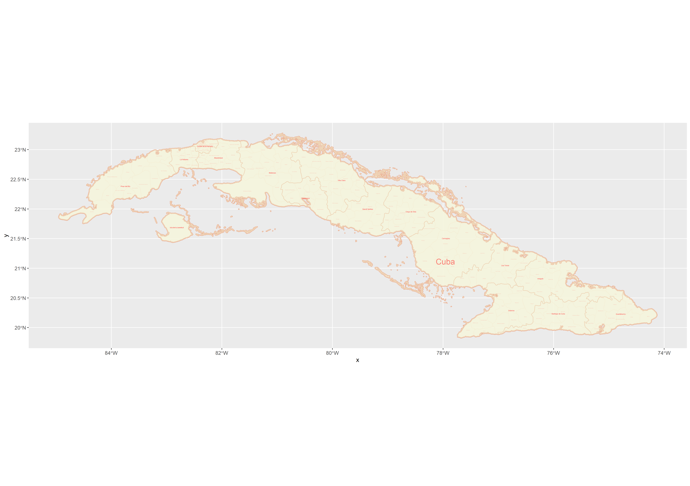
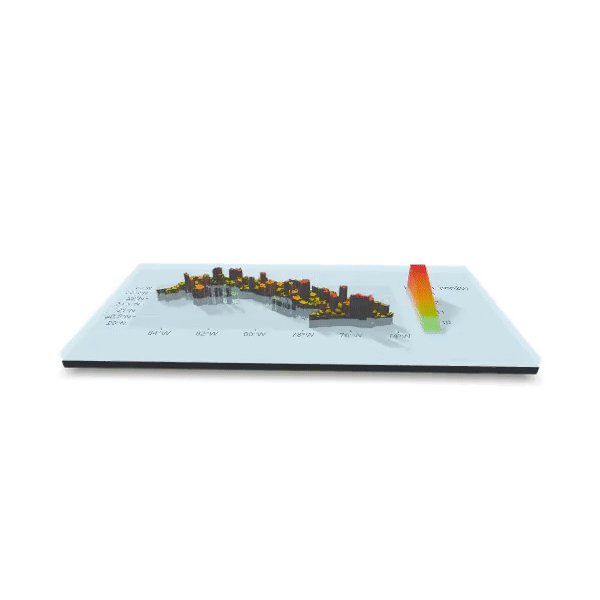

# Project 1 - Cuba

## Part 1: Projecting, Plotting and Labelling Administrative Subdivisions

This map depicts the nation of Cuba, as well as its first and second administrative subdivisions of 15 provinces and 168 municipalities. The data utilized to create this map is dated for 2020. The name of the country was made large and was positioned so that it did not cover the names of any provinces or municipalities. Province names were kept the same red-ish (firebrick1) color, but were made smaller, while municipality names were even smaller and a significantly lighter shade, so as to make it easy to distinguish between administrative levels and avoid confusion. Municipalities are separated by a relatively thin border line, while provinces and the nation are surrounded by thicker border lines. Due to there being a higher concentration of municipalities in the north-west part of Cuba in the province "Ciudad de la Habana," I opted to increase the size and resolution of the map, so that the text for the individual municipalities wasn't so jumbled together. The largest issue for me was understanding layers when using ggplot(), so when ordering the different administrative subdivisions, one may block out the other, and I didn't know that it was something that I needed to be careful of for a while. I enjoyed customizing the map with various colors so that it was of my liking. To find the perfect colors, I found a .pdf file online which listed just about every color that is usable on RStudio (at least without downloading a package). 

## Part 2: Extracting Populations from a Raster and Aggregating to each Unit

 

These maps show the population density of Cuba in a heat-map style by adding in raster population data. Only the second-level administrative subdivisions are shown to emphasize the individual municipalities rather than grouping them into provinces. Areas with low population counts are filled with a green color, while areas with mid-sized populations are filled orange, and highly populated areas are red. Populations for each municipality are reflected on a logarithmic scale, so that the few regions with relatively high (or low) populations aren't seen as drastically high or low on the 3D portrayal, or the only red or green spots on the 2D plot. I found it surprisingly easy to create the 3D model, though it did take a while to render, especially if boosting the FPS and total number of frames. Rendering the 2D plot also took a decent amount of time, meaning that changing small aspects, such as colors, was much more tedious. 

## Part 3: Creating a Geometric Bar Plot with your Simple Feature object

The final part of the project shows a population density map and bar graph for Cuba in 2020. Both the map and bar graph are specific to the first administrative level in Cuba. Both representations of population data also show the percent of the total population living within each individual province both by percent/numerical values, as well as by color, with a legend on the right defining the colors. The graphs accurately present the data, as it is true as of 2020 that the province "Ciudad de la Habana" has the greatest population between the provinces, and likewise all of the other data points seem to run true to form. The population seems to be fairly even throughout the nation, save for a slight above-average population count in the south-eastern portion, as well as the apparent spike in population in the the one province in the north-west. The numbers within the provinces on the map represent the population in persons/km^2. 

To create these, following the instructions on the GitHub page proved to be sufficient for nearly the entire project. Only when using the ggarrange() function did I have to search up how to correctly use the function, as I did not exactly know how to specify the spatial plot or the bar plot. The sizing of the final produced image also proved to be difficult, as Cuba is more wide than it is tall, while the bar plot by default seemed to be much taller, the combination of the two leading to a lot of empty white spaces on a final image. However, forcing the final image size to have a height of 3 rather than individually working on both of the plot's individual sizes proved to be a quick fix. 
