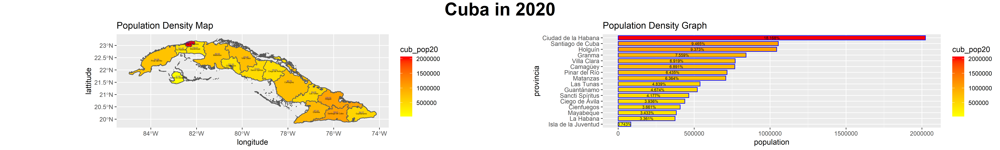

# Project 1 Individual Deliverable - Cuba



This project 1 deliverable shows a population density map and bar graph for Cuba in 2020. Both the map and bar graph are specific to the first administrative level in Cuba, which is comprised of 15 provinces. Both representations of population data also show the percent of the total population living within each individual province both by percent/numerical values, as well as by color, with a legend on the right defining the colors. The graphs accurately present the data, as it is true as of 2020 that the province "Ciudad de la Habana" has the greatest population between the provinces, and likewise all of the other data points seem to run true to form. 

```text
rm(list=ls(all=TRUE))

setwd("~/R/Wicked_Problems/Data")

#install.packages("raster", dep = TRUE)
#install.packages("doParallel", dep = TRUE)
#install.packages("snow", dep = TRUE)
#install.packages("rayshader", dep = TRUE)
#install.packages("remotes")
#remotes::install_github("tylermorganwall/rayshader", dependencies = TRUE)
#install.packages("pkgbuild", dep = TRUE)
#install.packages("units", dep = TRUE)
#install.packages("scales", dep = TRUE)
#install.packages("ggpubr", dep = TRUE)

Sys.getenv("R_LIBS_USER")

library(tidyverse)
library(sf)
library(raster)
library(doParallel)
library(snow)
library(ggplot2)
library(rayshader)
library(remotes)
library(pkgbuild)
library(units)
library(scales)
library(ggpubr)

load("cubadm1.RData")
#load("pop_vals_adm1.RData")

cub_adm1 <- cub_adm1 %>%
  mutate(area = sf::st_area(cub_adm1) %>%
           units::set_units(km^2)) %>%
  mutate(density = cub_pop20 / area)

p3bar <- cub_adm1 %>%
  mutate(NAME_1 = fct_reorder(NAME_1, cub_pop20)) %>%
  ggplot(aes(x = NAME_1, y = cub_pop20, fill = cub_pop20)) +
  geom_bar(stat = "identity", color = "blue", width = 0.75) +
  coord_flip() +
  xlab("provincia") + ylab("population") +
  geom_text(aes(label = percent(cub_pop20/sum(cub_pop20))),
            position = position_stack(vjust = 0.5),
            color = "black", size = 2.0) +
  scale_fill_gradient(low = "yellow", high = "red") +
  ggtitle("Population Density Graph")

ggsave("p3bar.png", width = 20, height = 10, dpi = 200)

p3map <- ggplot(cub_adm1) +
  geom_sf(aes(fill = cub_pop20)) +
  geom_sf_text(aes(label = NAME_1),
               color = "black",
               size = 1) +
  geom_sf_text(aes(label = round(density, 2)),
               color = "blue", size = 1, nudge_y = 0.05) +
  xlab("longitude") + ylab("lattitude") +
  scale_fill_gradient(low = "yellow", high = "red") +
  ggtitle("Population Density Map")

ggsave("p3spatial.png", width = 20, height = 10, dpi = 200)

annotate_figure(Cuba, top = text_grob("Cuba in 2020", color = "black", face = "bold", size = 26))
Cuba <- ggarrange(p3map, p3bar, nrow = 1, widths = c(2.25, 2))

ggsave("Cuba.png", width = 20, height = 3, dpi = 400)
```

